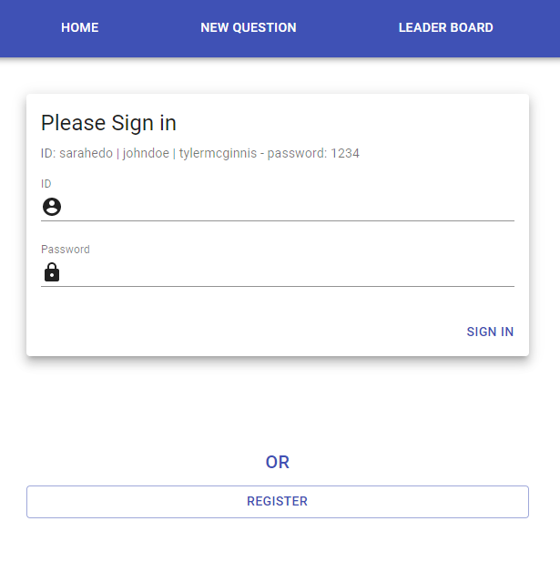
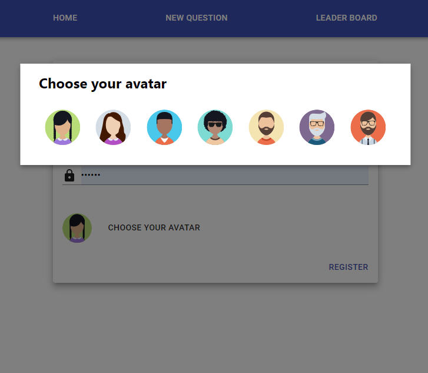
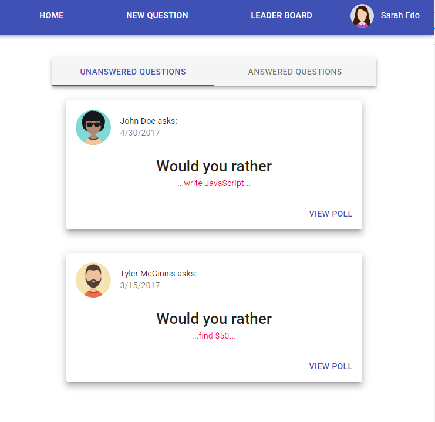
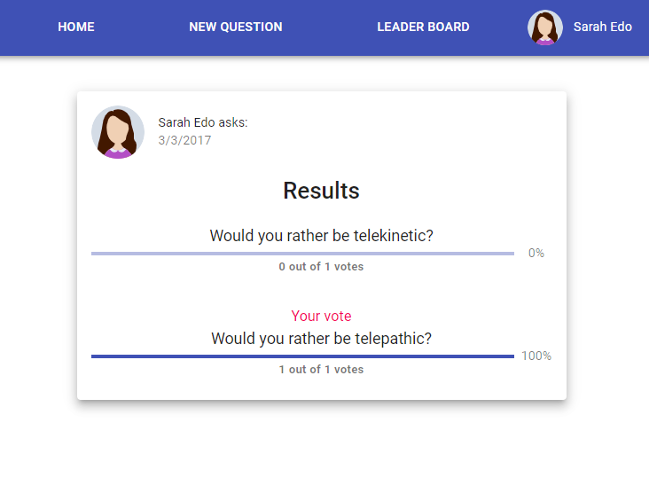

# Would You Rather

"Would You Rather" web app project. 

## Project Setup

* Clone the Project - `https://github.com/bytebruno/would-you-rather-react-redux.git`
* Install the dependencies - `yarn install` or `npm install` 
* Start the web app - `yarn start` or `npm start`

## Technologies

* ReactJs
* Redux
* Material UI

## Screenshots

